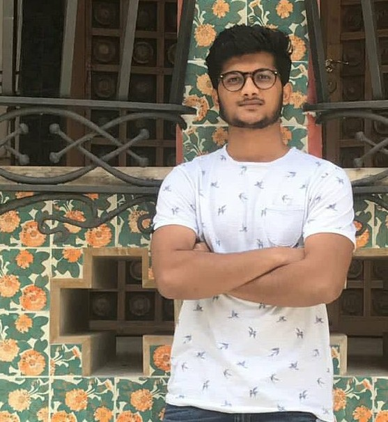

I am a Master's student specializing in Intelligent Systems, Robotics and Control at the Electrical and Computer Engineering Department, University of Californai San Diego (UCSD). Currently working on Robot Learning advised by <a href="https://xiaolonw.github.io/"> Prof. Xiaolong Wang</a>.

Prior to this I spent 2.5 years in the amazing city of Barcelona working as a graduate researcher at the Perception and Manipulation group, <a href="http://www.iri.upc.edu/">Institut de Robòtica i Informàtica Industrial</a>. I have worked on robot reinforcement learning with  <a href="http://www-iri.upc.es/people/torras/"> Prof.Carme Torras</a> and <a href="http://www.iri.upc.edu/people/galenya/"> Dr. Guillem Alenyà</a> at the Perception and Manipulation Group. 

I graduated in Engineering Physics as a Bachelor of Technology from <a href="http://www.iitg.ac.in/">Indian Institute of Technology Guwahati</a>. 

If you want to chat, shoot me an email at jangirrishabhgmail.com. Some of my projects are listed below.
